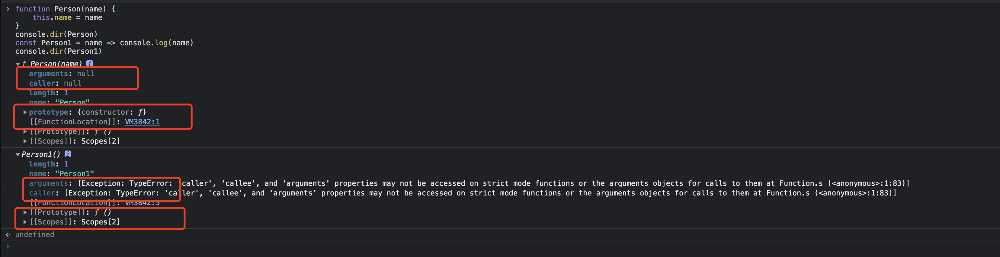
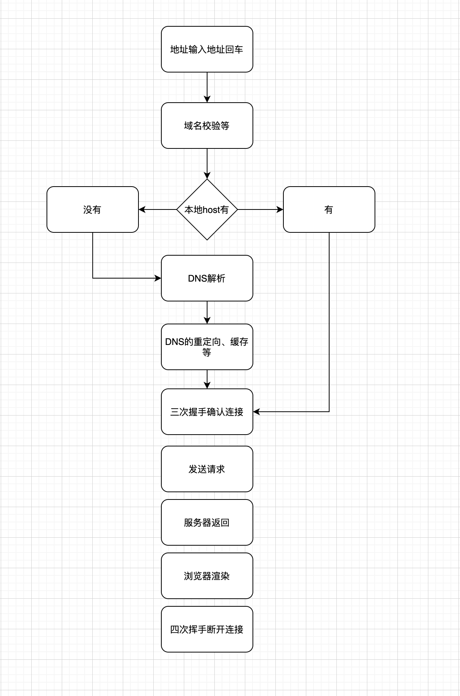
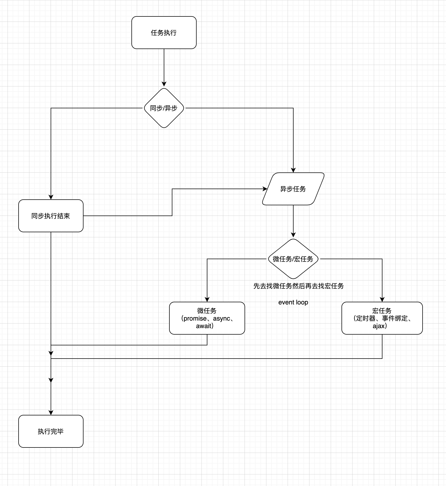
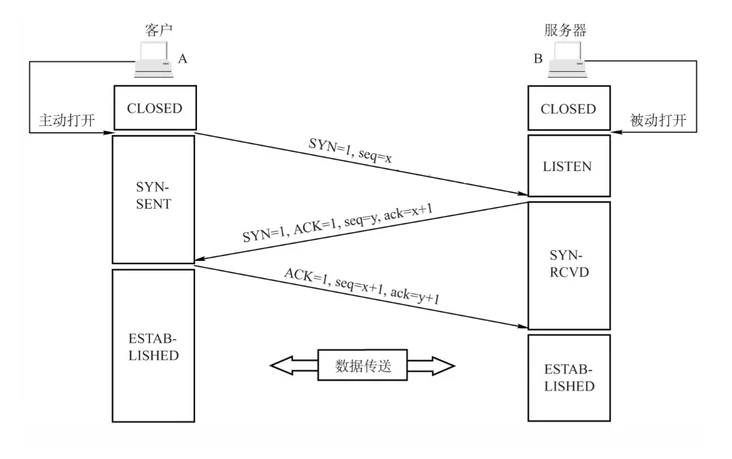
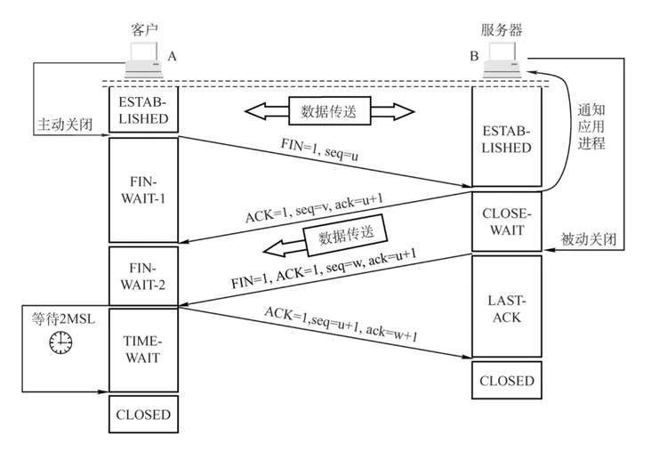

### js数据类型有哪些？怎么判断？
基本类型（值类型）：number、string、boolean、null、undefined、symbol

引用类型（对象类型）：object、array、function、regexp、date

1、typeof 方式
typeof 可以对基本类型number、string、boolean、undefined、symbol 做出准确的判断，null除外 因为 `typeof null === 'object'`
对于引用类型除function之外，都返回object
```js
typeof 10;                          // number 有效
typeof '';                          // string 有效
typeof true;                        // boolean 有效
typeof undefined;                    // undefined 有效
const symbol1 = Symbol();
typeof symbol1;                     // symbol 有效
typeof null;                        // object 无效
typeof new Function();              // function 有效
typeof [] ;                         // object 无效
typeof new Date();                  // object 无效
typeof new RegExp();                // object 无效
typeof null                         // object null的二进制全是0 所以判断为object
```
2、instanceof 方式
```js
function Foo() { }
var f1 = new Foo();
var dd = new Number(1)
console.log(f1 instanceof Foo);// true
console.log(dd instanceof Number); //true
console.log(123 instanceof Number); //false 不能判断字面量的基本数据类型
```
3、constructor 方式
```js
var a = new Number(1)
var b = 1
function fn() {
    console.log("aaa");
}
var date = new Date();
var arr = [1, 2, 3];
var reg = /12/gi;

console.log(a.constructor);//ƒ Number() { [native code] }
console.log(b.constructor.name);//Number
console.log(fn.constructor.name) // Function 
console.log(date.constructor.name)// Date 
console.log(arr.constructor.name) // Array 
console.log(reg.constructor.name) // RegExp
```
4、Object.prototype.toString 方式
```js
Object.prototype.toString.call('')                 // [object String]
Object.prototype.toString.call(11)                 // [object Number]
Object.prototype.toString.call(true)               // [object Boolean]
Object.prototype.toString.call(undefined)           // [object Undefined]
Object.prototype.toString.call(null)               // [object Null]
Object.prototype.toString.call(new Function())     // [object Function]
Object.prototype.toString.call(new Date())         // [object Date]
Object.prototype.toString.call([])                 // [object Array]
Object.prototype.toString.call(new RegExp())       // [object RegExp]
```

### new的时候发生了什么？实现一个new？
- 创建类的实例-对象
- 创建实例的时候执行构造函数

```js
class Person {
    // 构造函数
    constructor(name) {
        this.name = name
    }
    eat() {
        console.log(`${this.name}正在吃饭！`)
    }
}
const p = new Person('aa')
p.eat() // aa 正在吃饭
----------------------------------------------------
function Person(name) {
    this.name = name
}
Person.prototype.eat = function() {
    console.log(`${this.name}正在吃饭！`)
}
function myNew(fn, ...args) {
    // 创建空对象
    const obj = {}
    // 修改原型
    obj.__proto__ = fn.prototype
    // 执行
    const res = fn.apply(obj, args)
    return typeof res === 'object' ? res : obj
}
// 创建实例
const p = myNew(Person, 'aa')
p.eat() // aa 正在吃饭
```

### 为什么箭头函数不能当做构造函数？
- 没有自己的this，arguments，super或new.target。
- 没有prototype
- 不能用作构造函数
```js
function Person(name) {
    this.name = name
}
console.dir(Person)
const Person1 = name => console.log(name)
console.dir(Person1)
```



### 闭包？
函数执行，形成私有的执行上下文，使内部私有变量不受外界干扰，起到保护和保存的作用
<br>
优势：
- 避免命名冲突
- 解决循环绑定引发的索引问题
- 变量不被销毁 可以使用函数内部的变量，使变量不会被垃圾回收机制回收
<br>
缺点：
- 会出现内存泄漏的问题

> vue 中的 data 就是闭包


### 原型？原型链？
**原型：** 原型分为隐式原型和显式原型，每个对象都有一个隐式原型，它指向自己的构造函数的显式原型。

**原型链：** 多个__proto__组成的集合成为原型链

- 所有实例的__proto__都指向他们构造函数的prototype
- 所有的prototype都是对象，自然它的__proto__指向的是Object()的prototype
- 所有的构造函数的隐式原型指向的都是Function()的显示原型
- Object的隐式原型是null


### 实现promise 和 promise.all
```js
class MyPromise {
    constructor(exec) {
        // 规定状态
        this.status  = "pending"
        this.value   = undefined
        this.reason  = undefined
        // 成功存放的数组
        this.success = []
        // 失败存放的数组
        this.fail    = []

        const resolve = (value) => {
            if (this.status === "pending") {
                this.status = "fulfilled"
                this.value = value
                this.success.forEach(f => f())
            }
        }
        const reject = (reason) => {
            if (this.status === "pending") {
                this.status = "rejected"
                this.value = value
                this.fail.forEach(f => f())
            }
        }

        try {
            exec(resolve, reject)
        } catch (error) {
            reject(error)
        }
    }
    then(onFulfilled, onRejected) {
        if (this.status === "fulfilled") onFulfilled(this.value)
        if (this.status === "rejected") onRejected(this.value)
        if (this.status === "pending") {
            this.success.push(() => onFulfilled(this.value) )
            this.fail.push(() => onRejected(this.reason) )
        }
    }
}

Promise.all = function (promises) {
    let list = []
    let count = 0
    function handle(i, data) {
        list[i] = data
        count++
        if (count == promises.length) {
            resolve(list)
        }
    }
    return Promise((resolve, reject) => {
        for (let i = 0; i < promises.length; i++) {
            promises[i].then(res => {
                handle(i, res)
            }, err => reject(err))
        }
    })
}
```

### call、apply、bind
- call、apply 相似，只是传参方式不同
- apply 、 call 、bind 都是用来改变函数的this对象的指向的
- apply 、 call 、bind 第一个参数都是this要指向的对象，也就是想指定的上下文
- apply 、 call 、bind 都可以利用后续参数传参
- bind 是返回对应函数，便于稍后调用; apply 、call 则是立即调用

实现call、apply、bind
```js
const call = function(context, ...args) {
    context.fn = this
    const result = context.fn(...args)
    delete context.fn
    return result
}
const apply = function(context, args) {
    // return this.call(context, ...args)
    context.fn = this
    const result = context.fn(...args)
    delete context.fn
    return result
}
const bind = function(context, ...args) {
    const f = this
    return function() {
        return f.apply(context, [...args, ...arguments])
    }
}
```

### 虚拟dom？在vue中做了什么？
- vue2.x版本之后才有虚拟dom
- 本质是一个js对象

- vue 的渲染过程（html、css、js）render()将真实dom转换成js对象，更新的时候可以用js对象做对比

### 实现 Diff 中的 patch()
1、对象转换为html标签之后插入 （递归）

2、校验新对象和旧对象的差异，然后在修改

### Vue 响应式原理，生命周期，vue3的 proxy？
```js
let obj = {
    name: ''
}
let newObj = JSON.parse(JSON.stringify(obj))
Object.defineProperty(obj, 'name', {
    get() {
        return newObj.name
    }
    set(val) {
        if(val === obj.name) return
        newObj.name = val
        // TODO: 
    }
})
----------------------------------------------------------

let obj = {}
obj = new Proxy(obj, {
    get(target, prop) {
        return target[prop]
    }
    set(target, prop, val) {
        if(val === target[prop]) return
        target[prop] = val
        // TODO: 
    }
})
```
### Computed 和 watch的区别


### vue的通信方式？
**1、父传子：**
子组件设置props，父组件设置v-bind ｜ ：

**2、子传父：**
子组件写$emit ，父组件设置v-on ｜ @

**3、任意组件通信：** `$bus`方式 
新建一个空的全局Vue对象，利用emit发送，on接收
```js
Vue.prototype.Event=new Vue();
Event.$emit(事件名,数据);
Event.$on(事件名,data => {});
```

**4、Vuex方式：** `state` `getters` `mutations` `actions` `modules`
[https://vuex.vuejs.org/zh/](https://vuex.vuejs.org/zh/)
- state
    - 存储数据
    - 获取数据使用 `getters`, 也可以使用 `mapState` 方式  ` ...mapState(['方法名','方法名'])` 

- getters
    - 获取数据
    - `this.$store.getters.xxx` 或者 `...mapGetters(['方法名','方法名'])`

- mutations
    - 同步操作数据
    - `this.$store.commit("方法名",数据)` 或者 `...mapMutations(['方法名','方法名'])`

- actions
    - 异步操作数据
    - `this.$store.dispatch("方法名",数据)` 或者 `...mapActions(['方法名','方法名'])`

- modules
    - 多个模块，每个模块里面可以拥有自己的 state、mutation、action、getter

**5、Pinia方式：** [https://pinia.vuejs.org/](https://pinia.vuejs.org/) 和 vuex类似，要比vuex简洁

**6、parent/children方式**

**7、ref方式**

**8、localStorage、sessionStorage、cookie**
等等


### webpack？loader和plugin的区别？
loader 是转换 plugin 是扩展


### 地址栏输入网址之后发生了什么？
自己的理解画了个图



### 深拷贝浅拷贝
[查看](/js/最常用数组去重方法)


### 宏任务和微任务？事件循环（evenloop）
宏任务包含
- 事件绑定       （常用）
- setTimeout    （常用）
- setInterval   （常用）
- ajax          （常用）
- I/O
- UI交互事件
- postMessage
- MessageChannel
- setImmediate(Node.js 环境)

微任务包含
- Promise.then  （常用）
- Object.observe
- MutationObserver
- process.nextTick(Node.js 环境)




### 跨域？
常用方案：
- jsonp
- cors 
- proxy代理（开发环境）线上环境就使用nginx反向代理实现

### 三次握手四次挥手
> 很详细的一个文章 https://segmentfault.com/a/1190000039165592

**三次握手**



**四次挥手**




### http缓存？

### 回流和重绘？防抖和节流？

### 函数柯里化

### 算法，数组去重  等等
#### 排序
- 冒泡排序
- 快速排序（二分法）
- 插入排序

#### 数组去重
- 利用ES6方法 set
- for循环 splice去重 去重
- 利用indexOf去重
- 利用sort()方法 先排序然后
- 正则去重
- 等等

```js
// 正则去重
let arr = [1, 2, 6, 3, 3, 3, 4, 4, 5, 6, 7]
arr.sort()
arr = arr.join('|') + '|'
let reg = /(\d+\|)\1*/g
let newArr = []
arr.replace(reg, (val, group) => {
    newArr.push(parseFloat(group))
})
console.log(newArr)
```

### This 的指向问题？

### css 和 HTML 的一些？